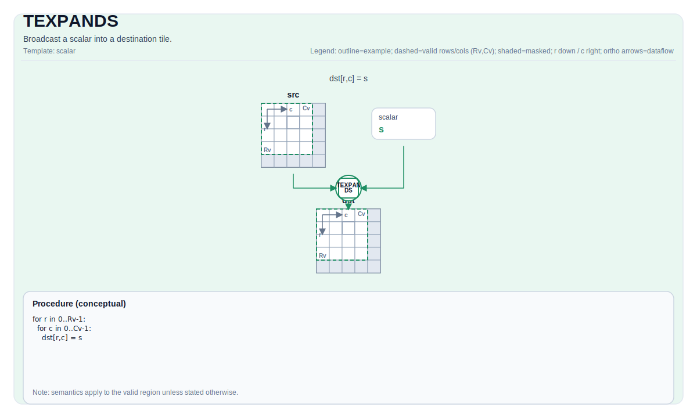

# TEXPANDS

## 指令示意图



## 简介

将标量广播到目标 Tile 中。

## 数学语义

对每个元素 `(i, j)` 在有效区域内：

$$ \mathrm{dst}_{i,j} = \mathrm{scalar} $$

## 汇编语法

PTO-AS 形式：参见 [PTO-AS Specification](../assembly/PTO-AS.md).

同步形式：

```text
%dst = texpands %scalar : f32, !pto.tile<...>
```

### AS Level 1 (SSA)

```text
%dst = pto.texpands %scalar : dtype -> !pto.tile<...>
```

### AS Level 2 (DPS)

```text
pto.texpands ins(%scalar : dtype) outs(%dst : !pto.tile_buf<...>)
```

### AS Level 1（SSA）

```text
%dst = pto.texpands %scalar : dtype -> !pto.tile<...>
```

### AS Level 2（DPS）

```text
pto.texpands ins(%scalar : dtype) outs(%dst : !pto.tile_buf<...>)
```

## C++ 内建接口

声明于 `include/pto/common/pto_instr.hpp`:

```cpp
template <typename TileData, typename... WaitEvents>
PTO_INST RecordEvent TEXPANDS(TileData &dst, typename TileData::DType scalar, WaitEvents &... events);
```

## 约束

- **实现检查 (A2A3)**:
    - For `TileType::Vec` :
    - `TileData::DType` must be one of: `int32_t`, `int16_t`, `half`, `float`.
    - Tile 布局 must be row-major (`TileData::isRowMajor`).
    - Static valid bounds: `TileData::ValidRow <= TileData::Rows` and `TileData::ValidCol <= TileData::Cols`.
    - For  `TileType::Mat` :
    - `TileData::DType` must be one of: `uint8_t`, `int8_t`, `uint16_t`, `int16_t`, `uint32_t`, `int32_t`, `half`, `float`.
    - Static valid bounds: `The range of  TileData::Rows * TileData::Cols * sizeof(T) / 32 is [1, 32767]`.
- **实现检查 (A5)**:
    - For `TileType::Vec` :
    - `TileData::DType` must be one of: `uint8_t`, `int8_t`, `uint16_t`, `int16_t`, `uint32_t`, `int32_t`, `half`, `float`.
    - Tile 布局 must be row-major (`TileData::isRowMajor`).
    - Static valid bounds: `TileData::ValidRow <= TileData::Rows` and `TileData::ValidCol <= TileData::Cols`.
    - For  `TileType::Mat` :
    - `TileData::DType` must be one of: `uint8_t`, `int8_t`, `uint16_t`, `int16_t`, `uint32_t`, `int32_t`, `half`, `float`.
    - For`TileDataDst::layout == pto::Layout::NC1HWC0 || TileDataDst::layout == pto::Layout::FRACTAL_Z`:
      - `The range of convtile's (shape0 * shape1 * shape2 * shape3) is [1, 32767]`.
    - For`TileDataDst::layout == pto::Layout::NDC1HWC0 || TileDataDst::layout == pto::Layout::FRACTAL_Z_3D`:
      - `The range of convtile's (shape0 * shape1 * shape2 * shape3 * shape4) is [1, 32767]`.
- **有效区域**:
    - For `TileType::Vec` :
    - The op fills `dst` over `dst.GetValidRow()` / `dst.GetValidCol()`.
    - For  `TileType::Mat` :
    - For Tile : The op fills `dst` over `TileData::Rows` / `TileData::Cols`.
    - For ConvTile : The op fills `dst` over `ConvTileData`'s shape.

## 示例

### 自动（Auto）

```cpp
#include <pto/pto-inst.hpp>

using namespace pto;

void example_auto() {
  using TileT = Tile<TileType::Vec, float, 16, 16>;
  TileT dst;
  TEXPANDS(dst, 0.0f);
}
```

### 手动（Manual）

```cpp
#include <pto/pto-inst.hpp>

using namespace pto;

void example_manual() {
  using TileT = Tile<TileType::Vec, float, 16, 16>;
  TileT dst;
  TASSIGN(dst, 0x1000);
  TEXPANDS(dst, 0.0f);
}
```
