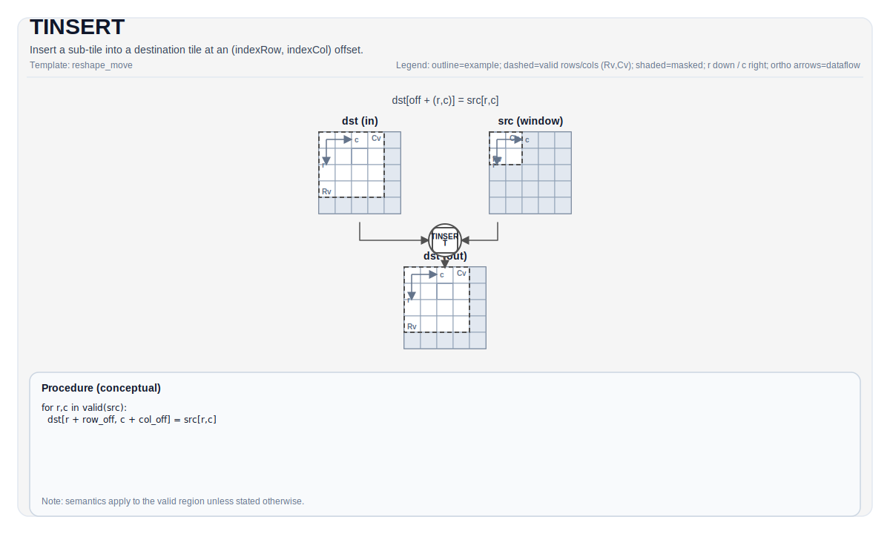

# TINSERT

## 指令示意图



## 简介

在 (indexRow, indexCol) 偏移处将子 Tile 插入到目标 Tile 中。

## 数学语义

Let `R = src.GetValidRow()` and `C = src.GetValidCol()`. Conceptually, for `0 <= i < R` and `0 <= j < C`:

$$
\mathrm{dst}_{\mathrm{indexRow}+i,\;\mathrm{indexCol}+j} = \mathrm{src}_{i,j}
$$

## 汇编语法

PTO-AS 形式：参见 [PTO-AS Specification](../assembly/PTO-AS.md).

同步形式：

```text
%dst = tinsert %src[%r0, %r1] : !pto.tile<...> -> !pto.tile<...>
```

### AS Level 1 (SSA)

```text
%dst = pto.tinsert %src[%r0, %r1] : !pto.tile<...> -> !pto.tile<...>
```

### AS Level 2 (DPS)

```text
pto.tinsert ins(%src[%r0, %r1] : !pto.tile_buf<...>) outs(%dst : !pto.tile_buf<...>)
```

### AS Level 1（SSA）

```text
%dst = pto.tinsert %src[%r0, %r1] : !pto.tile<...> -> !pto.tile<...>
```

### AS Level 2（DPS）

```text
pto.tinsert ins(%src[%r0, %r1] : !pto.tile_buf<...>) outs(%dst : !pto.tile_buf<...>)
```

## C++ 内建接口

声明于 `include/pto/common/pto_instr.hpp`:

```cpp
template <typename DstTileData, typename SrcTileData, typename... WaitEvents>
PTO_INST RecordEvent TINSERT(DstTileData &dst, SrcTileData &src, uint16_t indexRow, uint16_t indexCol, WaitEvents &... events);

template <typename DstTileData, typename SrcTileData, ReluPreMode reluMode, typename... WaitEvents>
PTO_INST RecordEvent TINSERT(DstTileData &dst, SrcTileData &src, uint16_t indexRow, uint16_t indexCol, WaitEvents &... events);

template <typename DstTileData, typename SrcTileData, ReluPreMode reluMode = ReluPreMode::NoRelu,
          typename... WaitEvents>
PTO_INST RecordEvent TINSERT(DstTileData &dst, SrcTileData &src, uint64_t preQuantScalar, uint16_t indexRow, uint16_t indexCol, WaitEvents &... events);
```

## 约束

- Runtime bounds must satisfy `indexRow + src.Rows <= dst.Rows` and `indexCol + src.Cols <= dst.Cols` (exact checks are target-dependent).

## 示例

See related examples in `docs/isa/` and `docs/coding/tutorials/`.
