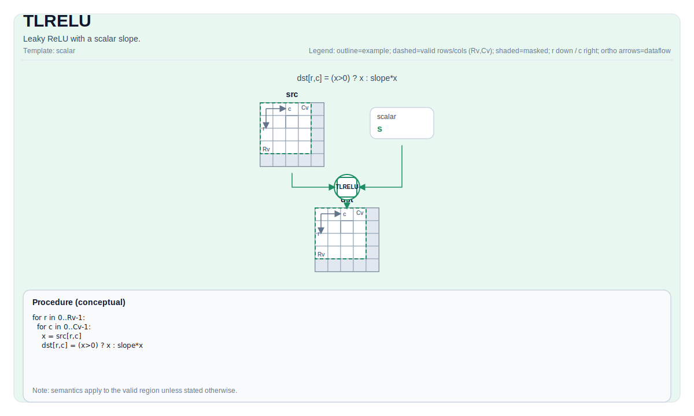

# TLRELU

## 指令示意图



## 简介

带标量斜率的 Leaky ReLU。

## 数学语义

对每个元素 `(i, j)` 在有效区域内：

$$ \mathrm{dst}_{i,j} = (\mathrm{src}_{i,j} > 0) ? \mathrm{src}_{i,j} : (\mathrm{src}_{i,j} \cdot \mathrm{slope}) $$

## 汇编语法

PTO-AS 形式：参见 [PTO-AS Specification](../assembly/PTO-AS.md).

同步形式：

```text
%dst = tlrelu %src, %slope : !pto.tile<...>, f32
```

### AS Level 1 (SSA)

```text
%dst = pto.tlrelu %src, %scalar : (!pto.tile<...>, dtype) -> !pto.tile<...>
```

### AS Level 2 (DPS)

```text
pto.tlrelu ins(%src, %scalar : !pto.tile_buf<...>, dtype) outs(%dst : !pto.tile_buf<...>)
```

### AS Level 1（SSA）

```text
%dst = pto.tlrelu %src, %scalar : (!pto.tile<...>, dtype) -> !pto.tile<...>
```

### AS Level 2（DPS）

```text
pto.tlrelu ins(%src, %scalar : !pto.tile_buf<...>, dtype) outs(%dst : !pto.tile_buf<...>)
```

## C++ 内建接口

声明于 `include/pto/common/pto_instr.hpp`:

```cpp
template <typename TileData, typename... WaitEvents>
PTO_INST RecordEvent TLRELU(TileData& dst, TileData& src0, typename TileData::DType scalar, WaitEvents&... events);
```

## 约束

- **实现检查 (A2A3)**:
    - `TileData::DType` must be one of: `half`, `float16_t`, `float`, `float32_t` (floating-point types only).
    - Tile 布局 must be row-major (`TileData::isRowMajor`).
- **实现检查 (A5)**:
    - `TileData::DType` must be one of: `half`, `float16_t`, `float`, `float32_t` (floating-point types only).
    - Tile 布局 must be row-major (`TileData::isRowMajor`).
- **Common constraints**:
    - Tile location must be vector (`TileData::Loc == TileType::Vec`).
    - Static valid bounds: `TileData::ValidRow <= TileData::Rows` and `TileData::ValidCol <= TileData::Cols`.
    - Runtime: `dst` and `src` must have the same valid row/col.
    - Slope scalar type must match the Tile data type.
- **有效区域**:
    - The op uses `dst.GetValidRow()` / `dst.GetValidCol()` as the iteration domain.

## 示例

```cpp
#include <pto/pto-inst.hpp>

using namespace pto;

void example() {
  using TileT = Tile<TileType::Vec, float, 16, 16>;
  TileT x, out;
  TLRELU(out, x, 0.1f);
}
```
