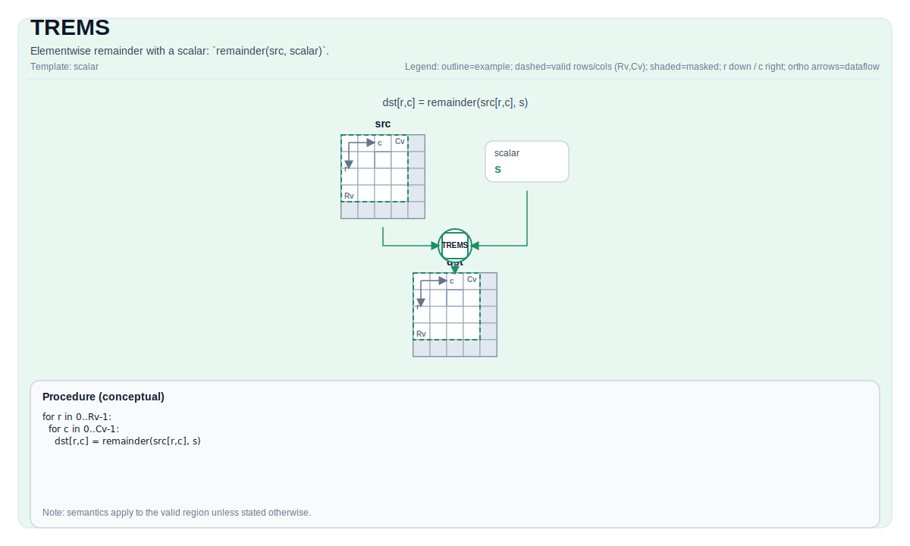

# TREMS

## 指令示意图



## 简介

与标量的逐元素余数：`remainder(src, scalar)`。

## 数学语义

对每个元素 `(i, j)` 在有效区域内：

$$\mathrm{dst}_{i,j} = \mathrm{src}_{i,j} \bmod \mathrm{scalar}$$

## 汇编语法

PTO-AS 形式：参见 [PTO-AS Specification](../assembly/PTO-AS.md).

同步形式：

```text
%dst = trems %src, %scalar : !pto.tile<...>, f32
```

### AS Level 1 (SSA)

```text
%dst = pto.trems %src, %scalar : (!pto.tile<...>, dtype) -> !pto.tile<...>
```

### AS Level 2 (DPS)

```text
pto.trems ins(%src, %scalar : !pto.tile_buf<...>, dtype) outs(%dst : !pto.tile_buf<...>)
```

### AS Level 1（SSA）

```text
%dst = pto.trems %src, %scalar : (!pto.tile<...>, dtype) -> !pto.tile<...>
```

### AS Level 2（DPS）

```text
pto.trems ins(%src, %scalar : !pto.tile_buf<...>, dtype) outs(%dst : !pto.tile_buf<...>)
```

## C++ 内建接口

声明于 `include/pto/common/pto_instr.hpp`:

```cpp
template <typename TileDataDst, typename TileDataSrc, typename... WaitEvents>
PTO_INST RecordEvent TREMS(TileDataDst &dst, TileDataSrc &src, typename TileDataSrc::DType scalar, WaitEvents &... events);
```

## 约束

- Division-by-zero behavior is target-defined; the CPU simulator asserts in debug builds.
- The op iterates over `dst.GetValidRow()` / `dst.GetValidCol()`.

## 示例

```cpp
#include <pto/pto-inst.hpp>

using namespace pto;

void example() {
  using TileT = Tile<TileType::Vec, float, 16, 16>;
  TileT x, out;
  TREMS(out, x, 3.0f);
}
```
