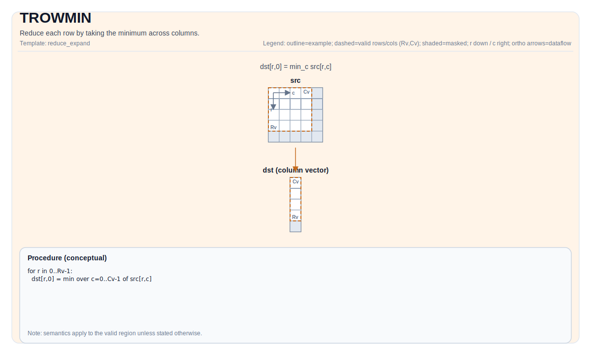

# TROWMIN

## 指令示意图



## 简介

通过取列间最小值来归约每一行。

## 数学语义

Let `R = src.GetValidRow()` and `C = src.GetValidCol()`. For `0 <= i < R`:

$$ \mathrm{dst}_{i,0} = \min_{0 \le j < C} \mathrm{src}_{i,j} $$

## 汇编语法

PTO-AS 形式：参见 [PTO-AS 规范](../assembly/PTO-AS_zh.md)。

同步形式：

```text
%dst = trowmin %src : !pto.tile<...> -> !pto.tile<...>
```
Lowering may introduce internal scratch tiles; the C++ intrinsic requires an explicit `tmp` operand.

### AS Level 1（SSA）

```text
%dst = pto.trowmin %src, %tmp : (!pto.tile<...>, !pto.tile<...>) -> !pto.tile<...>
```

### AS Level 2（DPS）

```text
pto.trowmin ins(%src, %tmp : !pto.tile_buf<...>, !pto.tile_buf<...>) outs(%dst : !pto.tile_buf<...>)
```

## C++ 内建接口

声明于 `include/pto/common/pto_instr.hpp`：

```cpp
template <typename TileDataOut, typename TileDataIn, typename TileDataTmp, typename... WaitEvents>
PTO_INST RecordEvent TROWMIN(TileDataOut& dst, TileDataIn& src, TileDataTmp& tmp, WaitEvents&... events);
```

## 约束

实现检查 (NPU):

- A2A3:
  - Tile 位置: `dst`且`src` 必须是 `TileType::Vec`.
  - Tile 布局 of `src`: ND fractal (`isRowMajor`且`SLayout::NoneBox`）。
  - Tile 布局 of `dst`:
    - **推荐**: DN layout Tile of 1D, 例如， `Tile<TileType::Vec, T, ROWS, 1, BLayout::ColMajor, ValidRows, 1>`
    - **将移除**: ND layout Tile of 2D, 例如， `Tile<TileType::Vec, T, ROWS, COLS, BLayout::RowMajor, ValidRows, 1>`
  - 数据类型: `half`或`float`.
  - 数据类型一致性: `dst.DType == src.DType`.
  - 运行期有效区域检查:
    - `srcValidCol != 0`且`srcValidRow != 0`.
    - `srcValidRow == dstValidRow` (the output valid row 必须匹配 the input valid row).
- A5:
  - 数据类型: `half`或`float`.
  - 数据类型一致性: `dst.DType == src.DType`.
  - No explicit runtime assertions on `validRow/validCol` 在实现中; the loops use `src.GetValidRow()`且`src.GetValidCol()`.

## 示例

### 自动（Auto）

```cpp
#include <pto/pto-inst.hpp>

using namespace pto;

void example_auto() {
  using SrcT = Tile<TileType::Vec, float, 16, 16>;
  using DstT = Tile<TileType::Vec, float, 16, 1, BLayout::ColMajor>;
  using TmpT = Tile<TileType::Vec, float, 16, 16>;
  SrcT src;
  DstT dst;
  TmpT tmp;
  TROWMIN(dst, src, tmp);
}
```

### 手动（Manual）

```cpp
#include <pto/pto-inst.hpp>

using namespace pto;

void example_manual() {
  using SrcT = Tile<TileType::Vec, float, 16, 16>;
  using DstT = Tile<TileType::Vec, float, 16, 1, BLayout::ColMajor>;
  using TmpT = Tile<TileType::Vec, float, 16, 16>;
  SrcT src;
  DstT dst;
  TmpT tmp;
  TASSIGN(src, 0x1000);
  TASSIGN(dst, 0x2000);
  TASSIGN(tmp, 0x3000);
  TROWMIN(dst, src, tmp);
}
```

## 汇编示例（ASM）

### 自动模式

```text
# 自动模式：由编译器/运行时负责资源放置与调度。
%dst = pto.trowmin %src, %tmp : (!pto.tile<...>, !pto.tile<...>) -> !pto.tile<...>
```

### 手动模式

```text
# 手动模式：先显式绑定资源，再发射指令。
# 可选（当该指令包含 tile 操作数时）：
# pto.tassign %arg0, @tile(0x1000)
# pto.tassign %arg1, @tile(0x2000)
%dst = pto.trowmin %src, %tmp : (!pto.tile<...>, !pto.tile<...>) -> !pto.tile<...>
```

### PTO 汇编形式

```text
%dst = trowmin %src : !pto.tile<...> -> !pto.tile<...>
# IR Level 2 (DPS)
pto.trowmin ins(%src, %tmp : !pto.tile_buf<...>, !pto.tile_buf<...>) outs(%dst : !pto.tile_buf<...>)
```

