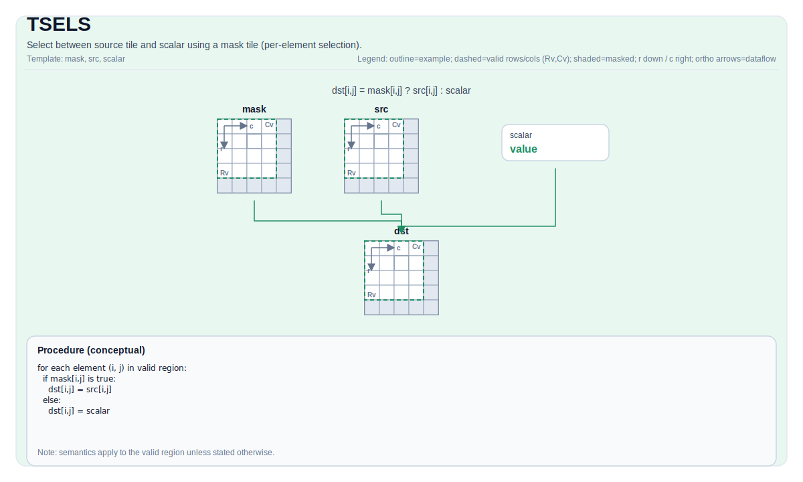

# TSELS

## 指令示意图



## 简介

使用标量 `selectMode` 在两个源 Tile 中选择一个（全局选择）。

## 数学语义

对每个元素 `(i, j)` 在有效区域内：

$$
\mathrm{dst}_{i,j} =
\begin{cases}
\mathrm{src}_{i,j} & \text{if } \mathrm{mask}_{i,j}\ \text{is true} \\
\mathrm{scalar} & \text{otherwise}
\end{cases}
$$

## 汇编语法

PTO-AS 形式：参见 [PTO-AS Specification](../assembly/PTO-AS.md).

同步形式：

```text
%dst = tsels %mask, %src, %scalar : !pto.tile<...>
```

### AS Level 1 (SSA)

```text
%dst = pto.tsels %mask, %src, %scalar : (!pto.tile<...>, !pto.tile<...>, dtype) -> !pto.tile<...>
```

### AS Level 2 (DPS)

```text
pto.tsels ins(%mask, %src, %scalar : !pto.tile_buf<...>, !pto.tile_buf<...>, dtype) outs(%dst : !pto.tile_buf<...>)
```

### AS Level 1（SSA）

```text
%dst = pto.tsels %src0, %src1, %scalar : (!pto.tile<...>, !pto.tile<...>, dtype) -> !pto.tile<...>
```

### AS Level 2（DPS）

```text
pto.tsels ins(%src0, %src1, %scalar : !pto.tile_buf<...>, !pto.tile_buf<...>, dtype) outs(%dst : !pto.tile_buf<...>)
```

## C++ 内建接口

声明于 `include/pto/common/pto_instr.hpp`:

```cpp
template <typename TileDataDst, typename TileDataMask, typename TileDataSrc, typename TileDataTmp, typename... WaitEvents>
PTO_INST RecordEvent TSELS(TileDataDst &dst, TileDataMask &mask, TileDataSrc &src, TileDataTmp &tmp, typename TileDataSrc::DType scalar, WaitEvents &... events);
```

## 约束

- **实现检查 (A2A3)**:
    - `TileData::DType` must be one of: `half`, `float16_t`, `float`, `float32_t`.
- **实现检查 (A5)**:
    - `TileData::DType` must be one of: `int8_t`, `uint8_t`, `int16_t`, `uint16_t`, `int32_t`, `uint32_t`, `half`, `float`.
- **Common constraints**:
    - Tile 布局 must be row-major (`TileData::isRowMajor`).
    - Tile location must be vector (`TileData::Loc == TileType::Vec`).
    - Static valid bounds: `TileData::ValidRow <= TileData::Rows` and `TileData::ValidCol <= TileData::Cols`.
    - Runtime: `dst`, `src0` and `src1` must have the same valid row/col.
    - Scalar type must match the Tile data type.
- **有效区域**:
    - The op uses `dst.GetValidRow()` / `dst.GetValidCol()` as the iteration domain.
- **Mask encoding**:
    - The mask tile is interpreted as packed predicate bits in a target-defined layout.

## 示例

### 自动（Auto）

```cpp
#include <pto/pto-inst.hpp>

using namespace pto;

void example_auto() {
  using TileDst = Tile<TileType::Vec, float, 16, 16>;
  using TileSrc = Tile<TileType::Vec, float, 16, 16>;
  using TileTmp = Tile<TileType::Vec, float, 16, 16>;
  using TileMask = Tile<TileType::Vec, uint8_t, 16, 32, BLayout::RowMajor, -1, -1>;
  TileDst dst;
  TileSrc src;
  TileTmp tmp;
  TileMask mask(16, 2);
  float scalar = 0.0f;
  TSELS(dst, mask, src, tmp, scalar);
}
```

### 手动（Manual）

```cpp
#include <pto/pto-inst.hpp>

using namespace pto;

void example_manual() {
  using TileDst = Tile<TileType::Vec, float, 16, 16>;
  using TileSrc = Tile<TileType::Vec, float, 16, 16>;
  using TileTmp = Tile<TileType::Vec, float, 16, 16>;
  using TileMask = Tile<TileType::Vec, uint8_t, 16, 32, BLayout::RowMajor, -1, -1>;
  TileDst dst;
  TileSrc src;
  TileTmp tmp;
  TileMask mask(16, 2);
  float scalar = 0.0f;
  TASSIGN(src, 0x1000);
  TASSIGN(tmp, 0x2000);
  TASSIGN(dst, 0x3000);
  TASSIGN(mask, 0x4000);
  TSELS(dst, mask, src, tmp, scalar);
}
```
