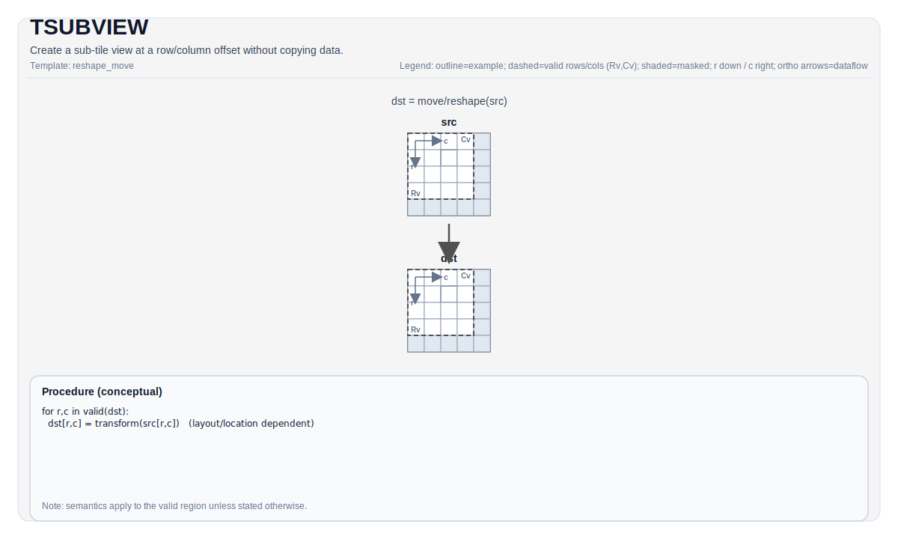

# TSUBVIEW

## Tile Operation Diagram



## Introduction

Create a sub-tile view at a row/column offset without copying data.

## Math Interpretation

Semantics are instruction-specific. Unless stated otherwise, behavior is defined over the destination valid region.

## Assembly Syntax

PTO-AS form: see `docs/assembly/PTO-AS.md`.

### IR Level 1 (SSA)

```text
%dst = pto.tsubview ...
```

### IR Level 2 (DPS)

```text
pto.tsubview ins(...) outs(%dst : !pto.tile_buf<...>)
```
## C++ Intrinsic

Declared in `include/pto/common/pto_instr.hpp`.

## Constraints

Refer to backend-specific legality checks for data type/layout/location/shape constraints.

## Examples

See related instruction pages in `docs/isa/` for concrete Auto/Manual usage patterns.
